# 💧 Water Tank Level Monitor

An IoT system built with an **ESP32** microcontroller and two **JSN-SR04T** waterproof ultrasonic sensors to monitor the water level of two 500-liter residential tanks in real time.

The system publishes measurements to **Adafruit IO** for remote dashboard visualization, sends **WhatsApp alerts** via the CallMeBot API when levels are critically low, and supports **over-the-air (OTA) firmware updates** through a built-in web server.

---

## 📋 Table of Contents

- [Features](#-features)
- [System Architecture](#-system-architecture)
- [Hardware](#-hardware)
  - [Components](#components)
  - [Water Tank Dimensions](#water-tank-dimensions)
  - [Volume Calculation](#volume-calculation)
  - [Voltage Divider (5V → 3.3V)](#voltage-divider-5v--33v)
  - [Schematic](#schematic)
  - [Breadboard Layout](#breadboard-layout)
  - [Final Assembly (PCB)](#final-assembly-pcb)
- [Firmware](#-firmware)
  - [Dependencies](#dependencies)
  - [Pin Mapping](#pin-mapping)
  - [Full Commented Source Code](#full-commented-source-code)
- [Dashboard (Adafruit IO)](#-dashboard-adafruit-io)
- [WhatsApp Alerts](#-whatsapp-alerts)
- [Known Issues & Field Notes](#-known-issues--field-notes)
- [References](#-references)

---

## ✨ Features

| Feature | Details |
|---|---|
| 🌊 Dual tank monitoring | Measures water level in two separate tanks simultaneously |
| 📡 Remote access | Live and historical dashboard hosted on Adafruit IO |
| 📲 WhatsApp alerts | Push notifications when water volume falls below threshold |
| 🌐 OTA firmware update | Update firmware wirelessly via browser (no USB required) |
| 🔁 Auto weekly reset | Prevents memory leaks with a scheduled weekly restart |
| 🛡️ Outlier rejection | Discards readings that deviate more than 1000 L from the previous value |

---

## 🏗 System Architecture

```
┌────────────────────────────────────────────────────────┐
│                     ESP32 (Wi-Fi)                      │
│                                                        │
│  JSN-SR04T ──(ECHO via voltage divider)──► GPIO 12     │
│  JSN-SR04T ──(ECHO via voltage divider)──► GPIO 13     │
│  GPIO 14 ──(TRIGGER)──────────────────────► Both SR04  │
│                                                        │
│  ┌──────────────────────────────────────────────────┐  │
│  │  Loop (every ~1 min)                             │  │
│  │  1. Read 5 distance samples from each sensor     │  │
│  │  2. Average samples                              │  │
│  │  3. Calculate volume (truncated cone formula)    │  │
│  │  4. Reject outliers                              │  │
│  │  5. Publish to Adafruit IO via MQTT              │  │
│  │  6. Send WhatsApp alert if level is critical     │  │
│  └──────────────────────────────────────────────────┘  │
└────────────────────────────────────────────────────────┘
         │                          │
         ▼                          ▼
  io.adafruit.com            api.callmebot.com
  (MQTT dashboard)           (WhatsApp alerts)
```

---

## 🔧 Hardware

### Components

| Component | Quantity | Notes |
|---|---|---|
| ESP32 NodeMCU (30-pin) | 1 | Wi-Fi + Bluetooth SoC |
| JSN-SR04T Waterproof Ultrasonic Sensor | 2 | 5V, 2.5m cable, IP67 transducer |
| Resistor 1 kΩ | 2 | Part of ECHO voltage divider (R1) |
| Resistor 2.2 kΩ | 2 | Part of ECHO voltage divider (R2) |
| 5×7 cm perf board (ilhada) | 1 | For the final PCB assembly |
| Transparent plastic enclosure | 1 | Waterproof housing for the electronics |

> **Sensor datasheet summary (JSN-SR04T):**
> - Operating voltage: 5 V
> - Detection range: 20 cm – 600 cm
> - Transducer diameter: 25 mm
> - Cable length: 2500 mm
> - Connector type: 3.5 mm audio jack

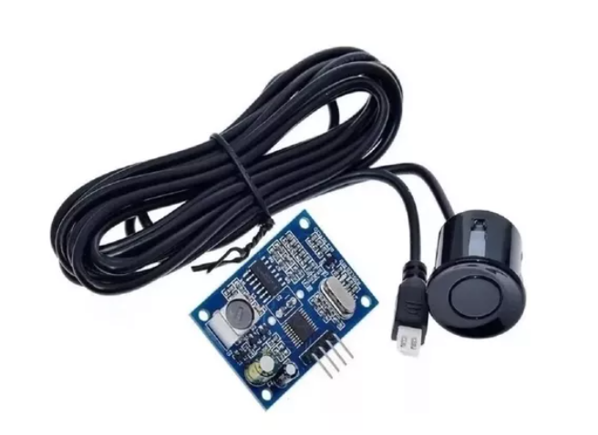
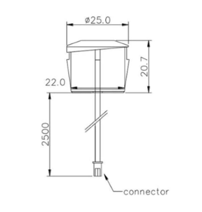

---

### Water Tank Dimensions

Both tanks have a **nominal capacity of 500 liters** and a **truncated-cone shape**.

The sensors are mounted on the tank lid, pointing downward.
The minimum distance (`distance_min`) represents the gap between the sensor face and the maximum water level when the tank is full.

#### Tank 01 (Fortlev-style, round lid)

| Parameter | Value |
|---|---|
| A – Total height (with lid) | 0.72 m |
| B – Inner height (without lid) | 0.58 m |
| C – Diameter (with lid) | 1.24 m |
| D – Diameter (without lid) | 1.22 m |
| E – Base diameter | 0.95 m |
| Effective water height `h_max_1` | 0.42 m *(measured: 0.66 m empty – 0.24 m sensor offset)* |
| Top inner radius `R1_1` | 0.61 m |
| Base radius `R2_1` | 0.48 m |
| Sensor-to-full-water offset | 0.24 m |

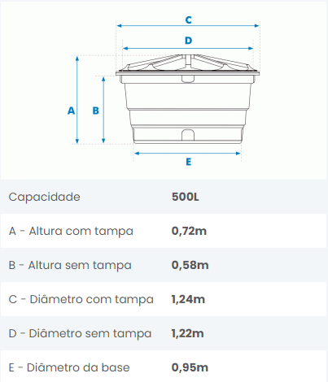

#### Tank 02

| Parameter | Value |
|---|---|
| B – Inner height (without lid) | 0.59 m |
| Top inner radius `R1_2` | 0.61 m |
| Base radius `R2_2` | 0.44 m |
| Sensor-to-full-water offset | 0.22 m |

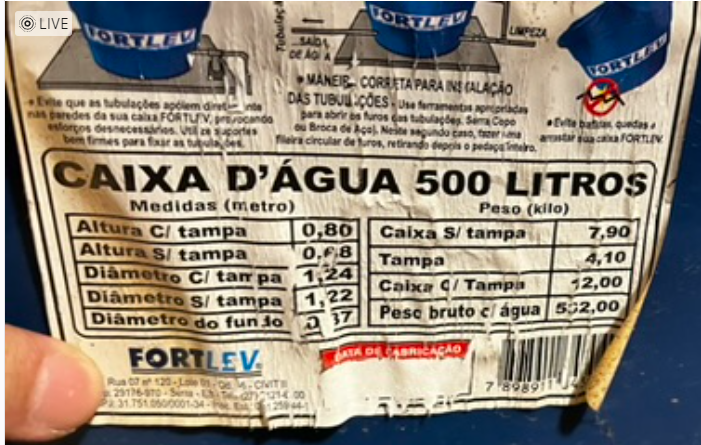

---

### Volume Calculation

The tanks have a **truncated-cone (frustum)** geometry. The volume of water at any height `h` is calculated as:

$$V = \frac{1}{3} \pi \, h \left( R_l^2 + R_l \cdot R_2 + R_2^2 \right)$$

where `R_l` is the inner radius at height `h`, found using similar triangles (Thales' theorem):

$$R_l = R_2 + (R_1 - R_2) \cdot \frac{h_l}{H}$$

- `R1` = radius at the top (maximum water level)
- `R2` = radius at the base
- `H` = maximum water height
- `h_l` = current water height (derived from sensor reading)
- `R_l` = radius at current water height

The sensor measures the **distance to the water surface**.  
The current water height is therefore:

```
h_current = h_max − (sensor_reading − sensor_offset)
```

---

### Voltage Divider (5V → 3.3V)

The JSN-SR04T ECHO pin outputs **5 V pulses**, which would damage the ESP32's 3.3 V GPIO inputs without protection. A simple resistor voltage divider is used on each ECHO line:

```
ECHO (5V) ──┬── R1 (1 kΩ) ──┬── R2 (2.2 kΩ) ── GND
            │               │
            │           To ESP32 GPIO (≈3.3V)
```

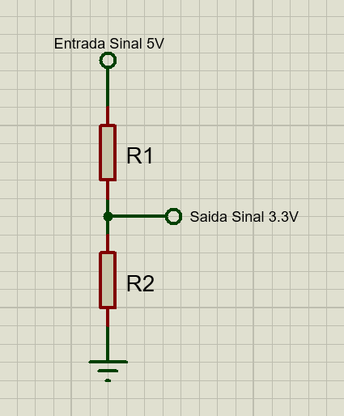

**Measured output voltage: 3.36 V** — confirmed safe for ESP32 inputs.

#### Voltage Validation Sketch

Run this sketch **before** connecting the ECHO lines to the ESP32. Measure the output of each voltage divider with an oscilloscope or multimeter and confirm it is ≤ 3.3 V.

```cpp
// ============================================================
// voltage_test.ino
// ============================================================
// Drives the TRIGGER pin continuously so that the JSN-SR04T
// ECHO line is active. Measure the voltage at the output of
// each resistor divider before connecting it to the ESP32.
//
// ⚠️  Do NOT connect the ECHO lines to the ESP32 until you
//     have confirmed the voltage is ≤ 3.3 V.
// ============================================================

const int triggerPin = 4; // GPIO4 – TRIGGER output

void setup() {
  pinMode(triggerPin, OUTPUT);
}

void loop() {
  // Generate a 10 µs trigger pulse
  digitalWrite(triggerPin, HIGH);
  delayMicroseconds(10);
  digitalWrite(triggerPin, LOW);
  delay(1); // ~1 ms between pulses
}
```

> **Measured result:** 3.36 V on both ECHO lines — confirmed safe.

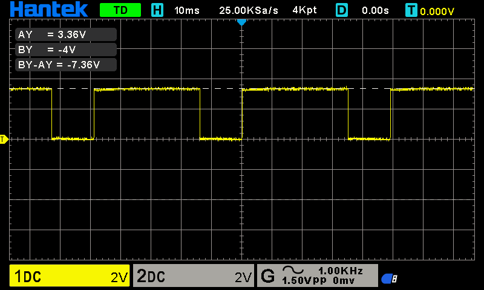

> ⚠️ **Safety procedure before wiring:**  
> Run the [voltage validation sketch](#voltage-validation-sketch) first,  
> measure the ECHO line with an oscilloscope or multimeter,  
> and only connect it to the ESP32 GPIO after confirming ≤ 3.3 V.

---

### Schematic

The full circuit schematic shows the ESP32 connected to both JSN-SR04T sensors, with voltage dividers on each ECHO line. The TRIGGER pins of both sensors share a single GPIO line (GPIO 14).

```
          ┌─────────────────────────────────────────┐
          │             ESP32 (30-pin)              │
          │                                         │
5V ───────┤ VIN                           GPIO14 ───┼──── TRIG (both sensors)
GND ──────┤ GND                           GPIO12 ◄──┼──── ECHO01 (via divider)
          │                               GPIO13 ◄──┼──── ECHO02 (via divider)
          └─────────────────────────────────────────┘

ECHO01: SR04_1 ECHO ─── R1(1kΩ) ─── node ─── R2(2.2kΩ) ─── GND
                                       │
                                    GPIO12

ECHO02: SR04_2 ECHO ─── R1(1kΩ) ─── node ─── R2(2.2kΩ) ─── GND
                                       │
                                    GPIO13
```

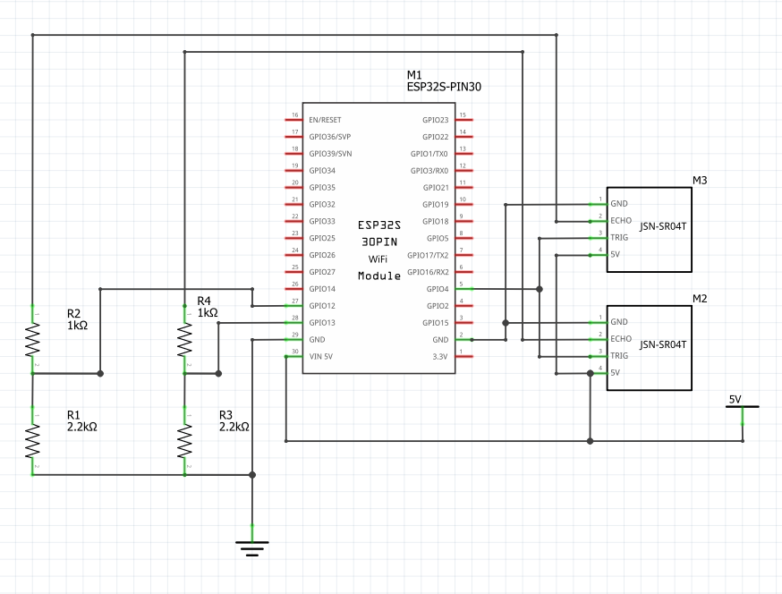

---

### Breadboard Layout

The prototype was first assembled on a breadboard for validation before being transferred to the permanent perf board. Both JSN-SR04T modules (mounted on blue breakout boards) connect through the resistor voltage dividers to the ESP32 NodeMCU.

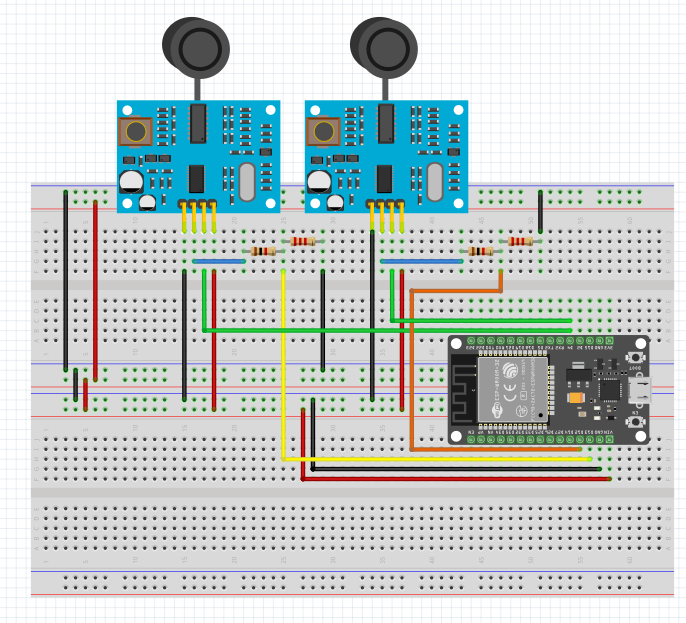
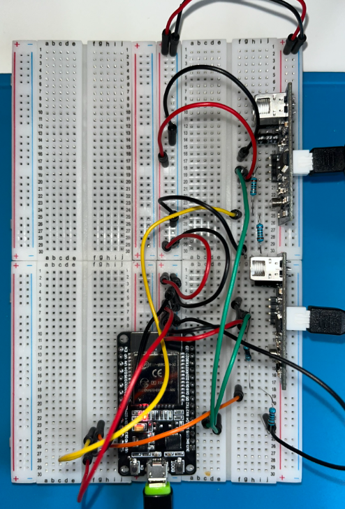
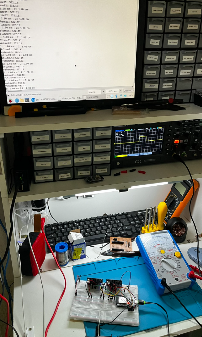

---

### Final Assembly (PCB)

The final assembly uses a 5×7 cm perf board (ilhada) soldered point-to-point following a hand-drawn layout diagram. The PCB is mounted inside a transparent plastic enclosure with standoffs, and the sensor cables exit through cable glands in the lid. The unit is powered via a USB cable.

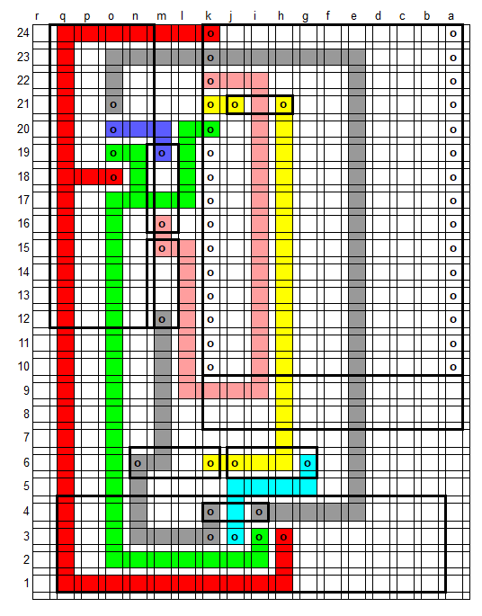
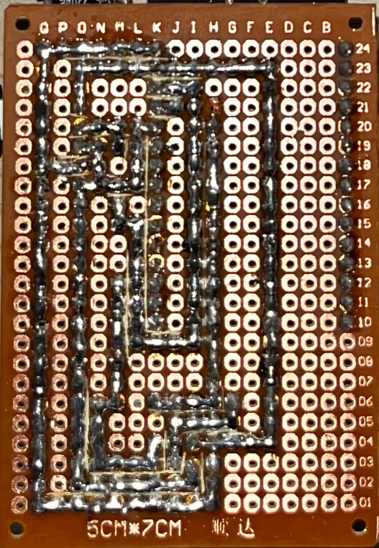
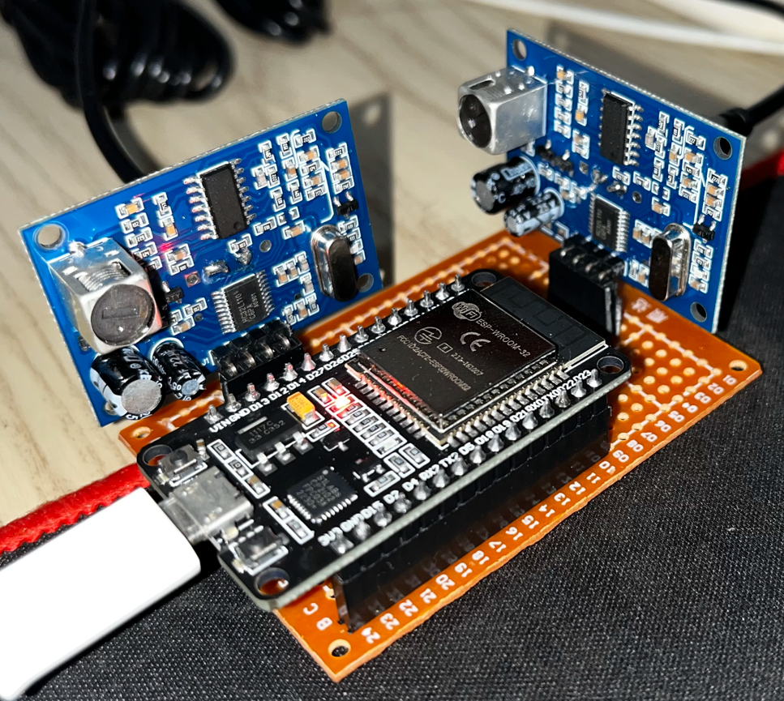
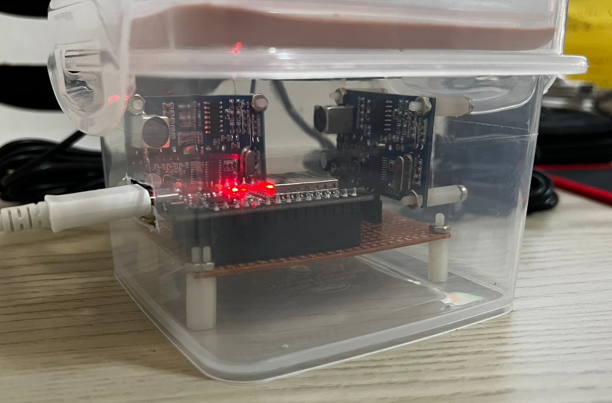

---

## 💻 Firmware

### Dependencies

Install the following libraries in the Arduino IDE (or `platformio.ini`):

| Library | Purpose | Source |
|---|---|---|
| `WiFi.h` | Wi-Fi connectivity (built-in ESP32) | Arduino ESP32 core |
| `Adafruit_MQTT` | MQTT client for Adafruit IO | Arduino Library Manager |
| `Adafruit_MQTT_Client` | MQTT client wrapper | Arduino Library Manager |
| `HCSR04` | Multi-sensor HC-SR04/JSN-SR04T driver | [GitHub – d03n3rfr1tz3/HC-SR04](https://github.com/d03n3rfr1tz3/HC-SR04) |
| `HTTPClient` | HTTP requests (WhatsApp API) | Arduino ESP32 core |
| `UrlEncode` | URL-encodes the WhatsApp message text | Arduino Library Manager |
| `WebServer` | Built-in HTTP web server | Arduino ESP32 core |
| `ESPmDNS` | mDNS for hostname resolution | Arduino ESP32 core |
| `HTTPUpdateServer` | OTA firmware update endpoint | Arduino ESP32 core |

> **Why use the HC-SR04 library instead of direct `pulseIn()`?**  
> Reading two sensors with raw `pulseIn()` calls in sequence causes significant timing interference between them, leading to unreliable readings. The HC-SR04 library handles multi-sensor timing correctly.

---

### Pin Mapping

| GPIO | Direction | Connected to |
|---|---|---|
| GPIO 14 | OUTPUT | TRIGGER of both JSN-SR04T sensors |
| GPIO 12 | INPUT | ECHO of Sensor 01 (via voltage divider) |
| GPIO 13 | INPUT | ECHO of Sensor 02 (via voltage divider) |

---

### Full Commented Source Code

#### `water_tank_monitor.ino`

```cpp
// ============================================================
// Water Tank Level Monitor
// ============================================================
// Monitors the water level in two 500-liter residential tanks
// using waterproof ultrasonic sensors (JSN-SR04T).
//
// Features:
//  - Publishes water volume to Adafruit IO via MQTT
//  - Sends WhatsApp alerts via CallMeBot API when level is low
//  - OTA firmware updates via a built-in web server
//  - Weekly automatic reset to prevent memory issues
//
// Author : Maurício Lopes
// Version: 1.1
// Date   : May 3, 2025
// History: Added weekly auto-reset routine
// ============================================================

// ============================================================
// Libraries
// ============================================================
#include <WiFi.h>                 // ESP32 Wi-Fi driver
#include "Adafruit_MQTT.h"        // Adafruit IO MQTT base
#include "Adafruit_MQTT_Client.h" // MQTT client over WiFiClient
#include <stdio.h>
#include <math.h>
#include <HCSR04.h>               // Multi-sensor ultrasonic library
#include <HTTPClient.h>           // HTTP client (for CallMeBot)
#include <UrlEncode.h>            // URL-encode message strings
#include <NetworkClient.h>
#include <WebServer.h>            // Built-in web server
#include <ESPmDNS.h>              // mDNS for hostname access
#include <HTTPUpdateServer.h>     // OTA update endpoint

// ============================================================
// Wi-Fi credentials
// ============================================================
const char *host     = "esp32-webupdate"; // mDNS hostname
const char *ssid     = "YOUR_SSID";       // Replace with your network SSID
const char *password = "YOUR_PASSWORD";   // Replace with your network password

// ============================================================
// WhatsApp alert credentials (CallMeBot)
// Format: international code + number, e.g. +5511988880000
// ============================================================
String phoneNumber = "+55XXXXXXXXXXX"; // Replace with your phone number
String apiKey      = "XXXXXXX";        // Replace with your CallMeBot API key

// ============================================================
// sendMessage()
// Sends a WhatsApp message via the CallMeBot HTTP API.
// Parameters:
//   message – the text to send (will be URL-encoded)
// ============================================================
void sendMessage(String message) {
  String url = "https://api.callmebot.com/whatsapp.php?phone="
               + phoneNumber
               + "&apikey=" + apiKey
               + "&text=" + urlEncode(message);

  HTTPClient http;
  http.begin(url);
  http.addHeader("Content-Type", "application/x-www-form-urlencoded");

  int httpResponseCode = http.POST(url);
  if (httpResponseCode == 200) {
    Serial.println("WhatsApp message sent successfully.");
  } else {
    Serial.print("WhatsApp send error. HTTP code: ");
    Serial.println(httpResponseCode);
  }
  http.end();
}

// ============================================================
// Adafruit IO MQTT credentials
// ============================================================
#define AIO_SERVER     "io.adafruit.com"
#define AIO_SERVERPORT 1883
#define AIO_USERNAME   "YOUR_AIO_USERNAME" // Replace with your Adafruit IO username
#define AIO_KEY        "YOUR_AIO_KEY"      // Replace with your Adafruit IO key

// MQTT client backed by a plain TCP socket
WiFiClient client;
Adafruit_MQTT_Client mqtt(&client, AIO_SERVER, AIO_SERVERPORT,
                          AIO_USERNAME, AIO_KEY);

// MQTT publish feeds (path format: <username>/feeds/<feedname>)
Adafruit_MQTT_Publish volume_caixa01 =
    Adafruit_MQTT_Publish(&mqtt, AIO_USERNAME "/feeds/volume.caixa01");
Adafruit_MQTT_Publish volume_caixa02 =
    Adafruit_MQTT_Publish(&mqtt, AIO_USERNAME "/feeds/volume.caixa02");

// ============================================================
// OTA web server
// ============================================================
WebServer        httpServer(80);   // HTTP server on port 80
HTTPUpdateServer httpUpdater;      // Serves the /update OTA endpoint

// ============================================================
// GPIO pin assignments
// ============================================================
byte trigger   = 14;                         // TRIGGER pin shared by both sensors
byte echoCount = 2;                          // Number of sensors
byte* echoPins = new byte[echoCount]{12, 13}; // ECHO pins: sensor01 → GPIO12, sensor02 → GPIO13

// ============================================================
// Volume calculation variables
// ============================================================
// Raw and filtered volume readings (liters)
float volume01     = 0;
float volume02     = 0;
float volume01_old = -1; // -1 signals "not yet initialized"
float volume01_new = -1;
float volume02_old = -1;
float volume02_new = -1;

// Calculated water heights and radii at current level
float h01_current  = 0;
float h02_current  = 0;
float R01_current  = 0.48;
float R02_current  = 0.44;

// Minimum sensor-to-water distances when tanks are full (meters)
// These compensate for the gap between the sensor face on the lid
// and the maximum water surface inside the tank.
float distance01_min = 0.24; // Tank 01: sensor is 24 cm above full-water level
float distance02_min = 0.22; // Tank 02: sensor is 22 cm above full-water level

// ============================================================
// Tank geometry constants (truncated-cone / frustum model)
// All dimensions in meters.
//
// Formula: V = (π·h/3) · (R_l² + R_l·R2 + R2²)
// where R_l = R2 + (R1 - R2) · (h_current / h_max)   [Thales' theorem]
//
// Tank 01 notes:
//   Measured distance sensor→bottom when empty: 0.66 m
//   Sensor-to-full-water offset: 0.24 m
//   → Effective maximum water height: 0.66 - 0.24 = 0.42 m
// ============================================================
#define PI     3.1415

// Tank 01 geometry
#define h_max_1 0.42  // Maximum water height (m)
#define R1_1    0.61  // Inner radius at the top / water surface (m)
#define R2_1    0.48  // Inner radius at the base (m)

// Tank 02 geometry
#define h_max_2 0.59  // Maximum water height (m)
#define R1_2    0.61  // Inner radius at the top / water surface (m)
#define R2_2    0.44  // Inner radius at the base (m)

// ============================================================
// initWiFi()
// Connects to the configured Wi-Fi network.
// Blocks until a connection is established.
// ============================================================
void initWiFi() {
  WiFi.disconnect();
  WiFi.mode(WIFI_STA);
  WiFi.begin(ssid, password);
  while (WiFi.status() != WL_CONNECTED) {
    delay(1000);
    Serial.println("Connecting to WiFi...");
  }
  Serial.println("Connected to WiFi.");
}

// ============================================================
// setup()
// Runs once at power-on or after a reset.
// ============================================================
void setup() {
  Serial.begin(115200);

  // Initialize the multi-sensor ultrasonic library
  HCSR04.begin(trigger, echoPins, echoCount);

  Serial.println("");
  Serial.println("MaLopes System");
  Serial.println("Water Tank Monitor – Version 1.1");
  Serial.println("Starting...");
  delay(3000);

  // Connect to Wi-Fi
  initWiFi();
  Serial.println(WiFi.localIP());

  // Start mDNS so the device is reachable as esp32-webupdate.local
  if (MDNS.begin(host)) {
    Serial.println("mDNS responder started.");
  }

  // Mount the OTA update server at /update
  httpUpdater.setup(&httpServer);
  httpServer.begin();
  MDNS.addService("http", "tcp", 80);
  Serial.printf("OTA ready: http://%s.local/update\n", host);

  // Notify that the system started (useful to detect power-cycles)
  sendMessage("Water tank monitor restarted.");
}

// ============================================================
// MQTT_connect()
// Ensures the MQTT client is connected to Adafruit IO.
// Reconnects Wi-Fi if lost, then retries MQTT up to 50 times
// before triggering a software reset.
// ============================================================
void MQTT_connect() {
  int8_t ret;

  // Nothing to do if already connected
  if (mqtt.connected()) return;

  // Ensure Wi-Fi is up before attempting MQTT
  while (WiFi.status() != WL_CONNECTED) {
    Serial.println("Reconnecting to WiFi...");
    WiFi.reconnect();
    delay(10000);
  }

  Serial.print("Connecting to MQTT... ");
  uint8_t retries = 50;
  while ((ret = mqtt.connect()) != 0) {
    Serial.println(mqtt.connectErrorString(ret));
    Serial.println("Retrying MQTT in 5 seconds...");
    mqtt.disconnect();
    delay(5000);
    retries--;
    if (retries == 0) {
      Serial.println("MQTT connection failed. Restarting...");
      ESP.restart();
    }
  }
  Serial.println("MQTT connected.");
}

// ============================================================
// Alert state machine
// Sends a WhatsApp alert when volume drops below threshold,
// then a recovery message when it rises back above it.
// A 120-minute cooldown prevents alert flooding.
// ============================================================
int counter       = 120; // Alert cooldown in main-loop cycles (1 cycle ≈ 1 min)
int alert_counter = counter;
int alert_flag    = 0;   // 1 = alert was sent and recovery not yet notified

// ============================================================
// Weekly reset counter
// Each main-loop cycle takes approximately 1 minute.
// 60 min × 24 h × 7 days = 10080 cycles.
// ============================================================
int rst_count = 10080;

// ============================================================
// loop()
// Main execution loop. Each iteration takes approximately
// 1 minute (5 samples × 10-second delay each).
// ============================================================
void loop(void) {
  // Keep the OTA web server responsive
  httpServer.handleClient();

  // Ensure MQTT is connected
  MQTT_connect();

  // ── Weekly auto-reset ─────────────────────────────────────
  if (rst_count < 1) {
    Serial.println("Weekly reset triggered. Restarting...");
    ESP.restart();
  } else {
    rst_count--;
  }

  // ── Sensor readings (5-sample average) ───────────────────
  float sum_01 = 0.0;
  float sum_02 = 0.0;
  float avg_01, avg_02;

  for (int i = 0; i <= 4; i++) {
    httpServer.handleClient(); // Stay responsive during long delays
    double* distances = HCSR04.measureDistanceCm();
    sum_01 += distances[0];
    sum_02 += distances[1];
    delay(10000); // 10-second inter-sample interval
  }
  avg_01 = sum_01 / 5.0;
  avg_02 = sum_02 / 5.0;

  // ── Volume calculation – Tank 01 ─────────────────────────
  // Current water height = max height − (sensor reading − min distance offset)
  h01_current = abs(h_max_1 - abs(abs(round(avg_01)) / 100.0 - distance01_min));
  // Current radius at water surface level (Thales' theorem)
  R01_current = R2_1 + (R1_1 - R2_1) * (h01_current / h_max_1);
  // Truncated-cone volume formula, result in liters (×1000 converts m³ → L)
  volume01 = 1000 * (PI * h01_current)
             * (R01_current * R01_current + R01_current * R2_1 + R2_1 * R2_1) / 3.0;
  if (volume01 < 0) volume01 = 0; // Clamp to zero (sensor at or below minimum)

  // ── Volume calculation – Tank 02 ─────────────────────────
  h02_current = abs(h_max_2 - abs(abs(round(avg_02)) / 100.0 - distance02_min));
  R02_current = R2_2 + (R1_2 - R2_2) * (h02_current / h_max_2);
  volume02 = 1000 * (PI * h02_current)
             * (R02_current * R02_current + R02_current * R2_2 + R2_2 * R2_2) / 3.0;
  if (volume02 < 0) volume02 = 0;

  Serial.print("Volume01: "); Serial.println(volume01);
  Serial.print("Volume02: "); Serial.println(volume02);

  // ── Outlier rejection – Tank 01 ──────────────────────────
  // On the first reading, initialise the history.
  // On subsequent readings, reject a sample if it deviates
  // more than 1000 L from the previous accepted value
  // (indicative of a sensor glitch rather than real consumption).
  if (volume01_old == -1) {
    volume01_old = volume01;
    volume01_new = volume01;
  } else if (fabs(volume01_old - volume01) > 1000) {
    volume01_new = volume01_old; // Keep previous value
  } else {
    volume01_new = volume01;
    volume01_old = volume01;
  }

  // ── Outlier rejection – Tank 02 ──────────────────────────
  if (volume02_old == -1) {
    volume02_old = volume02;
    volume02_new = volume02;
  } else if (fabs(volume02_old - volume02) > 1000) {
    volume02_new = volume02_old;
  } else {
    volume02_new = volume02;
    volume02_old = volume02;
  }

  // ── Publish to Adafruit IO ────────────────────────────────
  volume_caixa01.publish(volume01_new);
  delay(5000); // Brief pause between publishes to avoid rate-limiting
  volume_caixa02.publish(volume02_new);
  delay(5000);

  // ── WhatsApp alert logic ──────────────────────────────────
  // Alert thresholds: Tank 01 < 350 L or Tank 02 < 400 L
  if (volume01_new < 350 || volume02_new < 400) {
    if (alert_counter > 0) {
      alert_counter--; // Count down the cooldown
    } else {
      // Cooldown elapsed – send the alert
      sendMessage("Attention! Check the water tank levels.");
      alert_flag    = 1;    // Mark that an alert was sent
      alert_counter = counter; // Reset cooldown
    }
  } else {
    // Volume recovered – send one recovery message
    if (alert_counter < 10) {
      alert_counter++;
    } else {
      if (alert_flag == 1) {
        sendMessage("Volume appears to have normalised.");
        alert_flag = 0;
      }
    }
  }
}
```

---

## 📊 Dashboard (Adafruit IO)

Data is published to [io.adafruit.com](https://io.adafruit.com) via MQTT. A public dashboard shows:

- A **gauge** for each tank displaying the current volume in liters
- A **line chart** with 7-day historical data for each tank

The dashboard is accessible from any smartphone or computer without logging in.

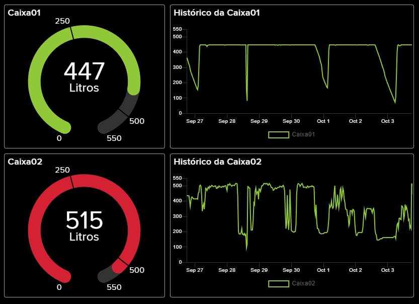

---

## 📲 WhatsApp Alerts

Alerts are sent using the [CallMeBot](https://www.callmebot.com) API (free, no app installation required):

| Condition | Message |
|---|---|
| Tank 01 < 350 L **or** Tank 02 < 400 L | "Attention! Check the water tank levels." |
| Volume recovers above threshold | "Volume appears to have normalised." |

A 120-minute cooldown prevents repeated alerts for a sustained low-level condition.  
A single recovery notification is sent once the level returns to normal.

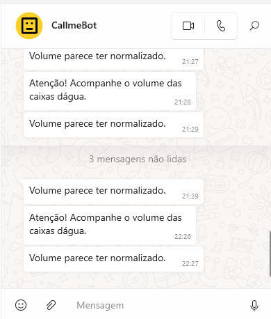

---

## 🧪 Known Issues & Field Notes

### October 3, 2024 – Unstable readings on Tank 02

After several weeks of operation, Tank 02 showed inconsistent readings that worsened with ambient temperature changes (speed of sound varies with temperature). New sensors were ordered.

### October 21, 2024 – Root cause identified: float interference

Replacing the Tank 02 sensor did not resolve the issue. After swapping sensor assignments between tanks, the instability followed the position (Tank 02), not the hardware. The hypothesis was confirmed: the sensor was positioned directly above the **float valve**, whose movement was reflecting and scattering the ultrasonic pulses.

**Fix:** The tank lid was rotated to place the sensor as far from the float valve as possible. Readings have been stable since.

### Temperature compensation (future improvement)

The JSN-SR04T measures distance based on the speed of sound (~343 m/s at 20 °C). The speed changes approximately 0.6 m/s per °C. Adding a DS18B20 or DHT22 temperature sensor would allow runtime compensation and improve accuracy in outdoor installations.

---

## 📚 References

- [Home Assistant Brasil – Measuring water tank volume](https://homeassistantbrasil.com.br/t/medindo-o-volume-da-caixa-de-agua/3668)
- [MakerHero – Monitor your water tank volume](https://www.makerhero.com/blog/monitore-o-volume-na-sua-caixa-dagua/)
- [Random Nerd Tutorials – ESP32 Wi-Fi reconnection](https://randomnerdtutorials.com/solved-reconnect-esp32-to-wifi/)
- [HC-SR04 multi-sensor library – d03n3rfr1tz3](https://github.com/d03n3rfr1tz3/HC-SR04/tree/master)
- [Fortlev 500L tank datasheet](https://www.fortlev.com.br/produtos/reservatorios/caixa-dagua-de-polietileno-500l/)

---

## 📄 License

This project is released under the [MIT License](LICENSE).
